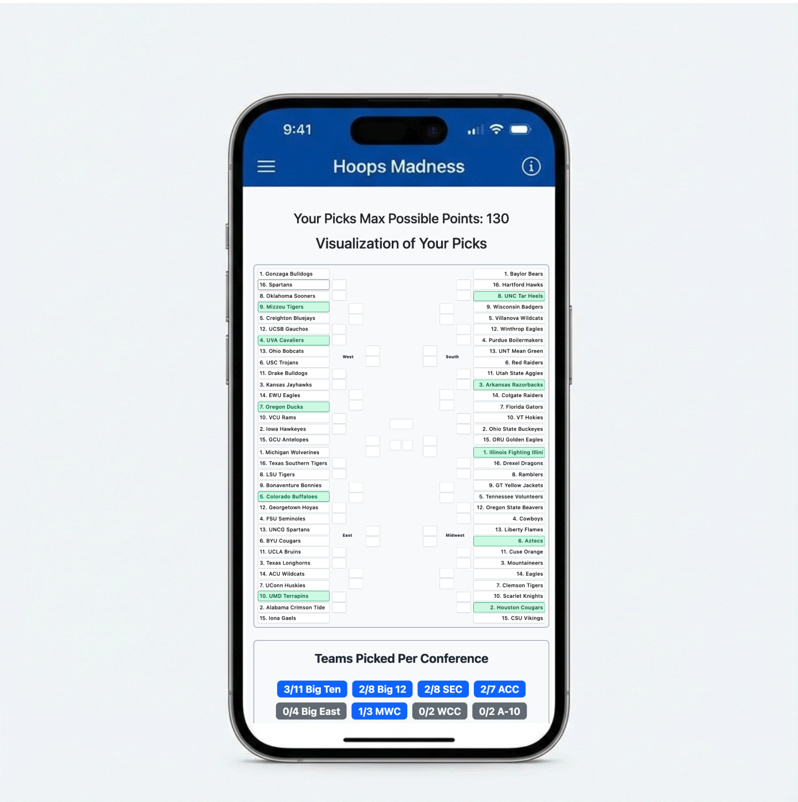

# Bracket 10

A self-hostable web app for running a march basketball bracket pool with your friends. Built on Node.js + Express + Google Cloud Firestore, served as a PWA, and deployed on Cloud Run for ~$0/month outside of tournament weekends.

[](https://github.com/jwieker/bracket10/actions/workflows/test.yml)
[](./LICENSE)

> **What you get:** a public bracket-entry flow with email + an admin dashboard, live ESPN score polling during the tournament, a leaderboard with possible-points projections, and a dual-PWA setup so the admin and public surfaces cache independently.



> **Status:** actively maintained by [@jwieker](https://github.com/jwieker). Designed for self-hosting — every personal/group-specific value is driven by environment variables (see [`.env.example`](./.env.example)). PRs welcome — see [CONTRIBUTING.md](./CONTRIBUTING.md).

## Getting Started

There are two paths. Pick whichever matches what you want:

- **🚀 [Quick local boot](#path-1--quick-local-boot)** — get the app running on your laptop in ~10 minutes. No GCP account required; uses the free Firestore emulator. Good for kicking the tires or contributing a PR.
- **🏆 [Self-host a real pool](#path-2--self-host-a-real-pool)** — deploy your own copy for your friend group. ~1–2 hours of setup the first time. Free tier covers most pools.

> **In a hurry? Use an AI assistant.** Most of the GCP wiring is mechanical — see [Setting it up with AI](#setting-it-up-with-ai) below for copy-paste prompts.

### Prerequisites (both paths)

- **Node.js v20.6+** (`node --version`). v20.6 is the minimum because the app uses Node's native `--env-file-if-exists` flag. The Dockerfile pins 24.14.
- **Git**.
- A terminal you're comfortable in.

### Path 1 — Quick local boot

Goal: get the homepage rendering on `http://localhost:8080`. Admin features (`/admin/*`) are skipped — they need Google OAuth, which Path 2 sets up.

```bash
# 1. Clone and install
git clone https://github.com/jwieker/bracket10.git
cd bracket10
npm install

# 2. Create your local .env from the template
cp .env.example .env

# 3. Generate a session secret and paste it into .env as SESSION_SECRET
node -e "console.log(require('crypto').randomBytes(48).toString('hex'))"

# 4. Start the Firestore emulator in another terminal (one-time gcloud install)
#    See: https://cloud.google.com/sdk/docs/install
gcloud emulators firestore start --host-port=localhost:8085

# 5. Back in the first terminal, tell the app to use the emulator and run it
export FIRESTORE_EMULATOR_HOST=localhost:8085
export GOOGLE_CLOUD_PROJECT=local-dev
npm run dev
```

You should see `Server running on http://localhost:8080`. Open it. The bracket page will be empty (no teams seeded yet) — that's expected. To load fixture data into the emulator, see the [seeding section](#seeding-fixture-data) below.

> **Don't want to install gcloud?** Set `GOOGLE_CLOUD_PROJECT=local-dev` and start the app anyway — most pages will throw Firestore errors, but the server will boot and you can navigate the codebase / run `npm test`.

### Path 2 — Self-host a real pool

This deploys a public-facing copy you can share with friends. Costs ~$0/month outside the tournament. The full IAM + deploy walkthrough is long, so it lives in [`docs/architecture/deployment.md`](./docs/architecture/deployment.md) — the steps below are the executive summary.

#### Step 1 — Create a GCP project and a Firestore database

1. In the [Google Cloud Console](https://console.cloud.google.com), create a new project. Note its **Project ID** (looks like `bracket-pool-123456`).
2. Enable billing on the project (the free tier covers everything below; you just need a card on file).
3. Enable these APIs: **Firestore**, **Cloud Run**, **Cloud Build**, **Artifact Registry**, **Cloud Scheduler**.
4. Create a Firestore database (Native mode, region `us-central1` or whatever's closest).

#### Step 2 — Create a Google OAuth client for admin login

1. In the Cloud Console, go to **APIs & Services → Credentials → Create credentials → OAuth client ID**.
2. Configure the OAuth consent screen if prompted (External, your email).
3. Choose **Web application**. Add an authorized redirect URI: `https://<your-domain>/auth/google/callback`. For local dev, also add `http://localhost:8080/auth/google/callback`.
4. Save the **Client ID** and **Client secret**.

#### Step 3 — Fill in `.env`

Copy the template and fill in real values. The required keys for a working deploy:

```bash
cp .env.example .env
```

| Variable                                    | What it is                                                                                               |
| ------------------------------------------- | -------------------------------------------------------------------------------------------------------- |
| `SESSION_SECRET`                            | Long random string. Generate: `node -e "console.log(require('crypto').randomBytes(48).toString('hex'))"` |
| `GOOGLE_CLOUD_PROJECT`                      | The GCP project ID from Step 1                                                                           |
| `GOOGLE_CLIENT_ID` / `GOOGLE_CLIENT_SECRET` | From Step 2                                                                                              |
| `ADMIN_EMAILS`                              | Comma-separated allowlist of admins (your own Gmail, etc.)                                               |
| `APP_HOST`                                  | Your production domain, e.g. `bracket.example.com`. Drives the OAuth callback and the `www.*` redirect   |

Optional but useful:

| Variable                                                                   | Effect                                                                                       |
| -------------------------------------------------------------------------- | -------------------------------------------------------------------------------------------- |
| `DEFAULT_GROUP`                                                            | Name shown when no group is specified. Defaults to `Default`.                                |
| `PRIORITY_GROUPS`                                                          | Comma-separated group names pinned to the top of pickers. e.g. `Family,Office`               |
| `PAYMENT_COLLECTOR_GROUP` + `PAYMENT_COLLECTOR_NAME` / `_EMAIL` / `_PHONE` | When an entry joins this exact group, the confirmation page renders a payment-contact block. |

The full annotated list is in [`.env.example`](./.env.example).

#### Step 4 — Boot it locally against your real database

```bash
gcloud auth application-default login   # one-time, gives your machine Firestore access
npm install
npm run dev
```

Open `http://localhost:8080`. Sign in at `/admin/login` with the Google account in `ADMIN_EMAILS`. Use the admin UI to create your first tournament (teams, groups, etc.) — see [`docs/architecture/database.md`](./docs/architecture/database.md) for the schema if you'd rather seed data programmatically.

#### Step 5 — Deploy to Cloud Run

The repo is set up for [Cloud Build](./cloudbuild.yaml) → Cloud Run. The shortest path:

```bash
# From your repo root:
gcloud builds submit --config=cloudbuild.yaml \
  --substitutions=_SERVICE_NAME=bracket-pool,REPO_NAME=$(basename $(pwd))

# Then set production env vars on the running service:
gcloud run services update bracket-pool \
  --region=us-central1 \
  --set-env-vars=SESSION_SECRET=...,GOOGLE_CLIENT_ID=...,GOOGLE_CLIENT_SECRET=...,ADMIN_EMAILS=...,APP_HOST=...
```

For a proper CI-driven setup (Cloud Build trigger on `main`, custom domain, IAM roles for the `/admin/cloud` dashboard, BigQuery billing export), follow [`docs/architecture/deployment.md`](./docs/architecture/deployment.md).

### Setting it up with AI

Most of the GCP / OAuth / Cloud Run config is mechanical busywork. If you're using an AI assistant (Claude Code, ChatGPT, Cursor, etc.), these prompts will get you most of the way. Paste them one at a time — give the assistant a chance to ask follow-ups.

**1. To bootstrap GCP from scratch:**

> I'm self-hosting an open-source Node.js + Firestore + Cloud Run app from this repo: https://github.com/jwieker/bracket10. Walk me through creating a brand-new Google Cloud project, enabling Firestore + Cloud Run + Cloud Build + Artifact Registry, creating a Firestore database in Native mode, and creating an OAuth 2.0 Web Application client with the redirect URIs `http://localhost:8080/auth/google/callback` and `https://<MY_DOMAIN>/auth/google/callback`. Output the exact `gcloud` commands I should run, and ask me for my project ID + domain before generating them.

**2. To fill in `.env`:**

> Read `.env.example` in this repo and ask me targeted questions to fill in each variable for my own deploy. Skip the optional sections unless I say I want them. Generate the final `.env` file at the end. Assume my pool name is `<YOUR_GROUP>` and my domain is `<YOUR_DOMAIN>`.

**3. To customize for your group:**

> I want to brand this for `<MY_POOL_NAME>`. Find and update: the homepage title in `views/`, the PWA manifests in `public/manifest.json` and `public/admin-manifest.json`, the `robots.txt` and `sitemap.xml` host, and any other places the old `bracket10` name appears. Keep the favicon for now — I'll replace it manually.

**4. To deploy:**

> Help me deploy this repo to Cloud Run on GCP project `<MY_PROJECT_ID>`. Run `gcloud builds submit --config=cloudbuild.yaml`, then set production env vars on the resulting service using `gcloud run services update`. Read my local `.env` to know which env vars to copy up. Use service name `bracket-pool` and region `us-central1`.

**5. To set up the ESPN polling jobs once the tournament approaches:**

> Read [`docs/features/espn-polling.md`](./docs/features/espn-polling.md) and [`docs/tournament/espn-setup.md`](./docs/tournament/espn-setup.md) and walk me through creating the Cloud Scheduler jobs `espn-poll-day` and `espn-poll-night` for my Cloud Run service `<SERVICE_NAME>` in project `<MY_PROJECT_ID>`. Verify they're correctly invoking `POST /admin/espn-poll` and ask me to confirm scores updated before you call it done.

> **Tip:** the AI assistant in [Claude Code](https://claude.com/claude-code) can run `gcloud` for you locally, so you don't have to copy commands back and forth. Just authenticate once with `gcloud auth login` and let it drive.

### Seeding and restoring database data

#### 1. Quick local emulator seeding

To populate your local Firestore emulator for development or testing, use the emulator seeding utility script. It automatically targets `localhost:8085` and `local-dev` by default:

- **Option A — Seed Real NCAA D-I Baseline (Recommended for UI & Playground testing):**
  Loads all ~360+ real D-I schools, active conferences, region mappings, mock groups, and PII-free mock bracket entries (from `/data/seed/` committed in Git) into the emulator:

  ```bash
  node scripts/seed-emulator.mjs
  ```

- **Option B — Seed Test Fixtures (Recommended for running integration tests):**
  Loads a 64-team synthetic bracket layout and integration test fixtures (from `/datafortests/` committed in Git):
  ```bash
  node scripts/seed-emulator.mjs --test
  ```

#### 2. Production seeding (All D-I teams & conferences)

When setting up a brand-new production database, it starts completely empty. The fastest and most reliable way to populate it with all ~360+ NCAA Division I schools, active conferences, and region mappings is to restore them from the pre-existing backups in `/databasebackup/`.

These backups already contain all D-I teams pre-enriched with their ESPN slugs, branding colors, abbreviations, and logo URLs.

To restore these core collections (`school`, `conferences`, `regionID`, `groups`) to your production database, run:

```bash
GCP_PROJECT_ID=your-gcp-project-id node scripts/restore-db.mjs
```

Arguments supported by the restore utility:

- `--dry-run`: Preview the restore operation and document count without writing anything.
- `--only=<collection>`: Only restore a specific collection (e.g. `--only=school`).

For a local emulator restore, simply prepend the emulator environment variables:

```bash
FIRESTORE_EMULATOR_HOST=localhost:8085 GCP_PROJECT_ID=local-dev node scripts/restore-db.mjs
```

#### 3. Regenerating and enriching team maps from scratch

If you ever need to regenerate the ESPN team maps or fetch live branding data directly from ESPN for new teams:

1. Run the conservative full-map builder to fetch all D-I teams from ESPN and match them to database schools:
   ```bash
   node scripts/buildFullD1Map.js
   ```
2. Any unmatched teams will be written to `src/config/espnTeamMap.json` with `null` values. Manually resolve their `sID`s at the bottom of the file.
3. Once the map is fully populated, fetch evergreen colors, abbreviations, and logo URLs from ESPN and write them back into your Firestore `school` collection:
   ```bash
   GCP_PROJECT_ID=your-gcp-project-id node scripts/enrichEspnData.js --force
   ```

### Running the app

```bash
npm run dev      # auto-reload on file changes (uses node --watch)
npm start        # one-shot production-style boot
```

| `NODE_ENV`    | UI                        | Tournament year                                         |
| ------------- | ------------------------- | ------------------------------------------------------- |
| `development` | All debug options visible | Dev year (in `src/config/app.js`)                       |
| `test`        | All debug options visible | Dev year, logs silenced                                 |
| `production`  | Production UI             | Whatever `currentYear` is set to in `src/config/app.js` |

### Running tests

```bash
npm test                     # full unit + integration suite (Vitest)
npm run test:coverage        # adds @vitest/coverage-v8 report (HTML in coverage/)
```

Tests run automatically on every push to `main` and every PR via [`.github/workflows/test.yml`](./.github/workflows/test.yml).

**Live E2E tests** hit a real Firestore database, are gated behind `LIVE_E2E=true`, and are intentionally not run in CI. Set up `GOOGLE_APPLICATION_CREDENTIALS` (or `gcloud auth application-default login`) before running:

```bash
npm run test:live-e2e        # small 4-game synthetic bracket
npm run test:live-e2e-v2     # full real 2022 bracket (64 teams, 63 games)
```

See `tests/e2e-v2.live.md` for full details.

### Troubleshooting

| Symptom                                                                         | Likely cause                                                                                                                                                |
| ------------------------------------------------------------------------------- | ----------------------------------------------------------------------------------------------------------------------------------------------------------- |
| `Error: SESSION_SECRET is required` (or session-related crash on first request) | `.env` missing or `SESSION_SECRET` not set. Re-run step 3.                                                                                                  |
| Pages load but Firestore writes fail with `PERMISSION_DENIED`                   | Either ADC isn't logged in (`gcloud auth application-default login`) or `GOOGLE_CLOUD_PROJECT` points at the wrong project.                                 |
| `/admin/login` redirects loop                                                   | The OAuth redirect URI registered in GCP doesn't match what the app is generating. Check `APP_HOST` in `.env` and the OAuth client config in Cloud Console. |
| `Error: Cannot find package 'vitest'` when running tests                        | Run `npm ci --ignore-scripts` (the repo policy is to install with `--ignore-scripts`).                                                                      |

### How to add a new API call

See [`CONTRIBUTING.md`](./CONTRIBUTING.md) for the Controller → Service → Repository pattern.

---

## Project Structure

- `/src` - Application source code
  - `/config` - Configuration files
  - `/controllers` - HTTP request handlers
  - `/middleware` - Express middleware
  - `/repositories` - Database access layer
  - `/routes` - API route definitions
  - `/services` - Business logic
  - `/utils` - Utility functions
- `/views` - EJS templates for rendering pages
- `/public` - Static assets
- `/tests` - Vitest test suite
- `/scripts` - Data migration and maintenance utilities
- `/docs` - AI assistant documentation (start with [docs/GUIDE.md](./docs/GUIDE.md))

## Architecture

This application follows the MVC (Model-View-Controller) pattern:

- **Routes**: Define API endpoints and handle request routing
- **Controllers**: Process HTTP requests and responses
- **Services**: Contain core business logic
- **Repositories**: Handle database interactions

For utilities, caching, security, PWA, and error handling details, start with [docs/GUIDE.md](./docs/GUIDE.md), especially the files under `docs/architecture/`.

## Security Notes

Current security invariants future contributors should preserve:

- Admin Google OAuth uses a session-backed `state` parameter before exchanging the authorization code.
- Public entry edit authorization is keyed by `year:entryId`, re-reads the stored entry before writes, and preserves server-owned fields (email, groups, payment, email-sent metadata).
- Production `DatabaseError` and `ServiceError` JSON payloads return generic messages while full details stay in server logs.

The broader security architecture lives in [docs/architecture/security.md](./docs/architecture/security.md).

## Dependency Notes

Runtime dependencies are intentionally kept small and boring:

- **Firestore:** `@google-cloud/firestore`
- **Server/rendering:** `express`, `ejs`, `express-session`, `compression`
- **Admin OAuth:** `google-auth-library`

Recent cleanup removed two app-level dependencies:

| Removed dependency   | Replacement                                                                              | Notes                                                                                                                             |
| -------------------- | ---------------------------------------------------------------------------------------- | --------------------------------------------------------------------------------------------------------------------------------- |
| `node-cache`         | Local TTL `Map` cache in [src/utils/cacheUtils.js](./src/utils/cacheUtils.js)            | Preserves `cacheGet`, `cacheSet`, `cacheDel`, `invalidateCache`, `clearAllCache`, cache stats, and debug headers used by the app. |
| `express-rate-limit` | Local focused middleware in [src/middleware/rateLimit.js](./src/middleware/rateLimit.js) | Preserves the current fixed-window per-client route limits and standard rate-limit headers.                                       |

Measured production install impact:

| Package area                  |    Before |     After |  Change |
| ----------------------------- | --------: | --------: | ------: |
| Root app, `npm ci --omit=dev` | 52,344 KB | 51,728 KB | -616 KB |
| `jobs`, `npm ci --omit=dev`   | 45,816 KB | 45,700 KB | -116 KB |

The percentage is small because the Firestore/Google dependency tree dominates the production install. The `jobs` image still uses `esbuild` as a dev/build dependency, but [Dockerfile.poll](./Dockerfile.poll) ships only the bundled `poll.mjs` into the production image.

## Databases

The application uses Google Cloud Firestore as the primary database.

| Collection     | Purpose                                                |
| -------------- | ------------------------------------------------------ |
| `entry`        | User bracket entries                                   |
| `games`        | Tournament game information                            |
| `school`       | Team information                                       |
| `schoolRecord` | Team performance records                               |
| `groups`       | User groups for competition                            |
| `conferences`  | College basketball conferences and their active status |

For schema details and data structure, see [docs/architecture/database.md](./docs/architecture/database.md).

## Domain Terminology

For definitions of Tournament, Game, Team, Entry, Group, Points system, and key field names, see [docs/domain.md](./docs/domain.md).

## Deployment

The application deploys to Google Cloud Run via Cloud Build. See [Path 2 — Self-host a real pool](#path-2--self-host-a-real-pool) above for the executive summary and [`docs/architecture/deployment.md`](./docs/architecture/deployment.md) for the full walkthrough (IAM, custom domain, CI trigger, billing export).

To see what's running once deployed:

```bash
gcloud run services describe <your-service-name> --region us-central1
```

## Cloud Scheduler (ESPN Poll Jobs)

Two Cloud Scheduler jobs hit `POST /admin/espn-poll` every 15 minutes during active game windows.

| Job               | Schedule                   | Window                   |
| ----------------- | -------------------------- | ------------------------ |
| `espn-poll-day`   | `*/15 17-23 * 3-4 0,4,5,6` | Thu–Sun, 5PM–midnight ET |
| `espn-poll-night` | `*/15 0-1 * 3-4 0,1,5,6`   | Fri–Mon, midnight–2AM ET |

```bash
gcloud scheduler jobs list --project=$GOOGLE_CLOUD_PROJECT --location=us-central1
```

```bash
gcloud scheduler jobs update http espn-poll-day \
  --project=$GOOGLE_CLOUD_PROJECT \
  --location=us-central1 \
  --schedule="*/15 17-23 * 3-4 0,4,5,6" \
  --time-zone="America/New_York"
```

> Note: These jobs are a source of Cloud Run network egress costs. Disable or reduce frequency when the tournament is not active.

For ESPN setup, activation steps, and historical import, see [docs/espn-setup.md](./docs/espn-setup.md).

## PWA Support

The application runs as two distinct PWAs (main app and admin app) to isolate caching.

- **Main manifest**: [public/manifest.json](./public/manifest.json)
- **Main service worker**: [public/service-worker.js](./public/service-worker.js)
- **Admin manifest**: [public/admin-manifest.json](./public/admin-manifest.json)
- **Admin service worker**: [public/admin-service-worker.js](./public/admin-service-worker.js)

For architecture details, see [docs/architecture/deployment.md](./docs/architecture/deployment.md#dual-pwa-architecture).

## Docker

```bash
docker build -f Dockerfile -t basketball .
docker run -p 8080:8080 basketball
```
