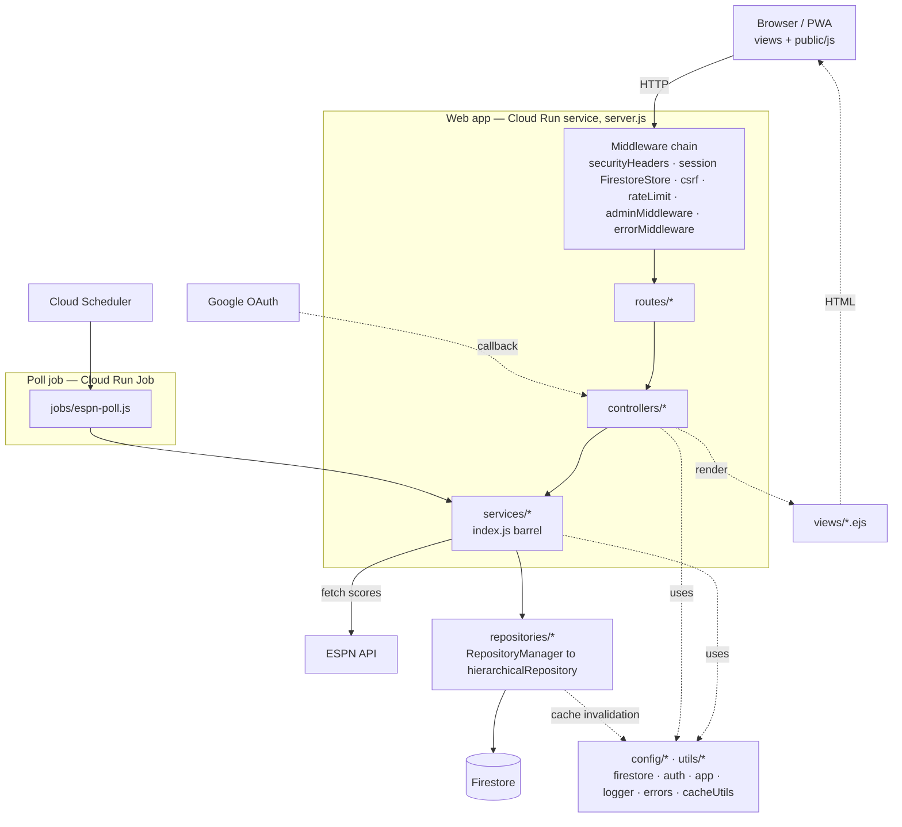

# Architecture Overview — Component Map

A static, big-picture map of how the system is wired: the layers, the cross-cutting
modules, and the external systems they talk to. This is the "what talks to what" view.

For the dynamic, per-request traces (who can trigger what, and the step-by-step flow
through each layer) see [`request-flows.md`](./request-flows.md), which has the mermaid
**sequence** diagrams. This doc deliberately stays at the component level and does not
duplicate those flows.

## Component diagram

## Layers

Requests flow strictly down the stack; only repositories touch Firestore. Be precise about
layer names (see [`GUIDE.md`](../GUIDE.md) § Architecture & Layers).

| Layer | Responsibility | Representative paths |
|-------|----------------|----------------------|
| **Routes** | Map a URL to its guard middleware and one controller method. Thin. | `src/routes/*.js` (e.g. `viewRoutes.js`, `adminRoutes.js`) |
| **Controllers** | Parse/validate input via `controllerUtils`, wrap handlers in `controllerWrapper`, render views or return JSON. | `src/controllers/*.js` (e.g. `resultsController.js`, `gameController.js`) |
| **Services** | Business logic, workflows, transaction orchestration. Reusable by both the web app and the poll job. | `src/services/*.js`, barrel `src/services/index.js` |
| **Repositories** | All Firestore reads/writes and atomic queries; owns cache invalidation on writes. | `src/repositories/index.js` (RepositoryManager) → `src/repositories/hierarchicalRepository.js` |
| **Views** | Server-rendered HTML; static assets and PWA served alongside. | `views/*.ejs`, `public/*` |

## Cross-cutting

- **Middleware** (`src/middleware/*`): `securityHeaders` (CSP/HSTS), session store
  (`firestoreSessionStore`), `csrf`, `rateLimit`, `adminMiddleware` (auth guards),
  `errorMiddleware` (last in the chain). The middleware chain is assembled in `server.js`.
- **Config** (`src/config/*`): `firestore` (client singleton), `auth` (OAuth, admin
  allowlist), `app`/`const` (tournament dates, scoring constants).
- **Utils** (`src/utils/*`): `logger` (structured JSON — use instead of `console.log`),
  `errors`, `cacheUtils` (in-memory TTL caches and invalidation), `controllerUtils`,
  `pointsUtils`.

## Two entry points, shared core

- **Web app** — `server.js` boots Express on Cloud Run, mounts all routers at `/`, and serves
  views/PWA.
- **Poll job** — `jobs/espn-poll.js` runs as a scheduled Cloud Run Job (triggered by Cloud
  Scheduler) and **bypasses Express entirely**. It calls `services/pollService.js`, which
  reuses the same services and repositories the web app uses, and writes to the same Firestore.

So game results have two writers (the admin HTTP path and the poll job) sharing
`gameService.updateTeamRecords`, with different points-recalculation strategies — see
`request-flows.md` for the detail.

## Related

- [`request-flows.md`](./request-flows.md) — per-request sequence diagrams and access tiers
- [`../features/routes.md`](../features/routes.md) — route-by-route reference
- [`database.md`](./database.md) — Firestore schema the repositories sit on
- [`security.md`](./security.md) — auth, CSP, rate limiting
- [`caching.md`](./caching.md) — cache keys, TTLs, invalidation
