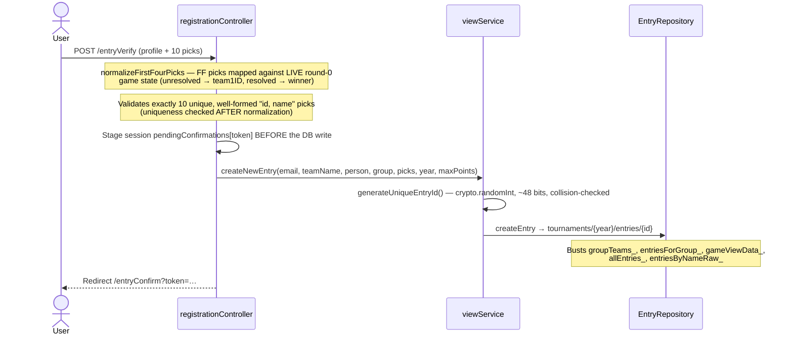

# Request Flows — Full Architecture Trace

End-to-end traces of how requests move through the app, organized by **who can
trigger them**: public visitors, verified entry owners, signed-in participants,
site admins, and the automated ESPN poll job. Use this when you need to know
"what happens when X is clicked" or "who is allowed to do Y".

For route-by-route reference see `docs/features/routes.md`; for auth mechanics
see `docs/architecture/security.md`.

## Layering (every flow follows this)

```
server.js
  → middleware chain: APP_HOST canonical redirect → securityHeaders → static →
    session (FirestoreStore) → json/urlencoded → compression → cacheDebug
  → src/routes/*.js          (URL → guard middleware → controller)
  → src/controllers/*.js     (parse/validate input via controllerUtils, wrap in controllerWrapper)
  → src/services/*.js        (business logic; services/index.js is the barrel)
  → src/repositories/index.js (RepositoryManager singletons → hierarchicalRepository.js)
  → Firestore
```

All seven routers mount at `/` in `server.js`. Unmatched paths fall through to
a wp-admin/php/env blocklist (403) and then a catch-all 404. `errorMiddleware`
is last.

## Access Tiers

| Tier | Session field | Guard | Set by |
|---|---|---|---|
| Public | — | none (rate limits only) | — |
| Verified entry owner | `verifiedEntries["year:entryId"]` | checked inline in `/my-entry/*` controllers | `POST /my-entry/verify` (Entry ID + email match) |
| Participant ("My Brackets") | `userEmail` | `requireUser` | Google OAuth, `oauthRole = "user"` branch |
| Site admin | `siteAdmin` | `requireSiteAdmin` | Google OAuth, `oauthRole = "admin"` branch + `ADMIN_EMAILS` allowlist |
| Automated poll job | — (no HTTP at all) | Cloud Run Jobs IAM | Cloud Scheduler |

The tiers are deliberately independent: `requireUser` never reads `siteAdmin`
and vice versa. A participant session grants zero admin access.

## 1. Public (anonymous) flows

### Create an entry (registration)
```
GET /                      indexController.index — state machine (comingsoon/registration/tournament)
POST /newEntry             registrationController.groupVerifyfornewEntry → verifyGroupExists → render registration.ejs
POST /entryVerify          registrationController.entryVerify
                             → validates name/team/email + exactly 10 unique picks ("id, name" shape)
                             → stages session pendingConfirmations[token] BEFORE the DB write (C7 ordering)
                             → viewService.createNewEntry → entryRepository
                             → redirect /entryConfirm?token=…
GET /entryConfirm          registrationController.entryConfirm — consumes single-use session token (10-min TTL),
                             renders confirm.ejs (never passes picks/PII in query params)
```


Window-gated by `isRegistrationOpen()` only indirectly (the home page hides the
form); `entryVerify` itself does not check the window — see Flagged
Inconsistencies #6.

### View results / grids
```
POST /gameView             resultsController.gameView → buildGameViewData (cached) → results.ejs
                             + per-user highlight: session userEmail/adminEmail → getEntryIdsForUserInGroup
POST /getFullGrid          buildFullGridData → fullGrid.ejs
GET  /getFullGridCSV       same data, CSV download
POST /calculateMaxPoints   pointsService.calculateMaxPossiblePoints (JSON)
GET  /playground           playgroundController.getPlayground — client-side what-if, no writes
```
All behind the in-memory `publicLimiter` (30/min/IP) except `/playground` and
`/entryConfirm`.

### Self-service edit, path A — Entry ID + email (`/my-entry`)
```
GET  /my-entry             lookup form (403 myEntryClosed outside registration window)
POST /my-entry/verify      publicLimiter + Firestore verifyLimiter (10/10min keyed by entryId)
                             → email match against stored entry (case-insensitive, anti-enumeration
                               error is identical for bad id vs bad email)
                             → session.regenerate → verifiedEntries["year:entryId"] = true
GET  /my-entry/edit        requires that exact session key → renderEntryEditor (myEditEntry.ejs)
POST /my-entry/update      same key + isRegistrationOpen() → applyEntryUpdate
                             → normalizeFirstFourPicks (live FF state) → 10-unique-picks check
                             → re-reads stored entry; server-owned fields (email, groups, payment,
                               emailSent) come from the stored entry, never the form
```

### Self-service edit, path B — Google sign-in (`/my-brackets`)
```
GET  /auth/google/user/start   oauthRole="user", random oauthState → Google
GET  /auth/google/callback     shared callback; "user" branch: any verified Google email →
                                 session.regenerate → userEmail (lowercased), 14-day cookie → /my-brackets
GET  /my-brackets              requireUser → getEntriesForUser(email) — all years
GET  /my-brackets/edit         requireUser + canEditYear(current year + window) + ownsEntry(email match)
POST /my-brackets/update       same gates, ownership re-checked against the STORED entry,
                                 then the same shared applyEntryUpdate as path A
```
Both paths funnel into the shared `renderEntryEditor` / `applyEntryUpdate`
helpers in `selfServiceController.js`, so the editor and write logic cannot drift
between the two authorization models.

## 2. Admin flows (all behind `requireSiteAdmin`)

### Login
```
GET /updates               adminLogin.ejs (redirects straight to /admin/tournament if already siteAdmin)
GET /auth/google/start     oauthRole="admin", rememberMe, oauthState → Google (Firestore loginLimiter 15/10min)
GET /auth/google/callback  state check → token exchange → ID token verified with audience pin →
                             ADMIN_EMAILS allowlist → session.regenerate → siteAdmin=true, adminEmail →
                             /admin/tournament   (rememberMe: 30-day cookie, else 8h)
POST /admin/logout         session destroy → /updates
```

### Updating scores (manual path)
```
/admin/tournament (adminTournament.ejs)  — Submit/Undo buttons use fetch()
POST /updateWinner         gameController.updateWinner
                             → gameService.updateTeamRecords(winner, loser, round, gameID, nextGame, spot, year)
                                 round 0 (First Four): resolve game, swap entry picks loser→winner,
                                   create canonical school record
                                 rounds 1–6: updateWinner doc + slot winner into nextGame +
                                   update both teams' record/points docs (parallel)
                             → updatePointsForAffectedEntries(year, [winner, loser]): targeted recalc
                               of only the entries holding either team (#369)
POST /undoGame             mirror image via gameService.undoTeamRecords + same targeted recalc
POST /admin/trigger-espn-poll   dry-run ONLY (runEspnPoll {dryRun:true}) — preview, never writes
```

```mermaid
sequenceDiagram
    actor Admin
    participant GC as gameController
    participant GS as gameService
    participant GR as GameRepository
    participant TR as TeamRepository
    participant PS as pointsService
    participant ER as EntryRepository

    Admin->>GC: POST /updateWinner
    GC->>GS: updateTeamRecords(winner, loser, round, gameID, nextGameID, spot, year)
    GS->>GR: updateWinner(gameID, winner, year)
    GS->>GR: updateNextGameTeam(nextGameID, spot, winner, year)
    Note over GR: Firestore transaction — looks up winner's name/seed and<br/>advances them into the next game; busts game + gameViewData_ caches
    GS->>TR: updateTeamRecord(winner …) and updateTeamRecord(loser …)
    GC->>PS: updatePointsForAffectedEntries(year, [winner, loser])
    Note over PS: Recalculates only the entries holding either team (#369)
    PS->>ER: updateMultipleEntryPoints(chunks)
    Note over ER: Busts standings caches (groupTeams_, entriesForGroup_, gameViewData_, …)
    GC-->>Admin: 200 OK
```

### Adding / editing a tournament
```
/admin/tournament (isNewTournament) → setup UI
POST /setupNewTourney      prepareNewTournamentData → newTourneyComplete.ejs (single-page creation form)
POST /admin/poll-espn-scheduled   fetchScheduledTournamentGames(date1, date2) + espnTeamMap →
                                    pre-populates the form from ESPN (read-only helper, no writes)
POST /createTournament     tourneyController.createTournament — parses regions, games, optional
                             First Four block (ff_team1_i/ff_team2_i/ff_seed_i/…, max 8) →
                             tourneyService.createNewBracket
  — legacy two-step alternative —
POST /regionVerify         prepareRegionVerifyData → newTourneyGames.ejs
POST /gamesVerify          createNewBracket (no First Four support)

```

```mermaid
sequenceDiagram
    actor Admin
    participant TC as tourneyController
    participant TS as tourneyService
    participant TR as TourneyRepository

    Admin->>TC: POST /createTournament
    Note over TC: parseYear / parsePositiveInt; optional First Four block (max 8 games)
    TC->>TS: createNewBracket(gamesData, year, regions, firstFourData)
    Note over TS: createNewBracketStructure() builds the 63-game topology<br/>from static vectors (BRACKET_R1_NEXT_GAME, BRACKET_R2PLUS_GAME_ID)
    TS->>TR: insertRegionsForYear(year, allRegionIDs)
    TS->>TR: insertMultipleGamesWithoutTeams (R2+ — team slots null)
    TS->>TR: insertMultipleGamesWithTeams (R1 — teams assigned)
    TS->>TR: insertMultipleSchoolRecords(teamRecords)
    alt includeFirstFour
        TS->>TS: createFirstFourGames(firstFourData, year, regions)
        TS->>TR: insertFirstFourGames + insertFirstFourSchoolRecords
    end
    TC-->>Admin: 200 Tournament created
```

```
POST /tournamentGames      viewTournament → editTourneyGames.ejs   (POST /editTournament is an alias)
POST /tournamentGamesUpdate  updateBracket → diff of school changes → updateEntrywithNewSchools
                               (rewrites affected entry picks)
POST /deleteTournament     tourneyService.deleteTournament(year)
```

### Entries / teams / groups / conferences / system
```
Entries:      GET /find-entry, GET /viewEntry, POST /entryUpdate (admin CAN set groups/payment/emailSent —
              unlike the self-service update), GET /unpaid-entries, POST /deleteEntry, POST /newGroup
Emails:       GET /admin/unsent-emails, POST /admin/mark-emails-sent (Gmail-MCP workflow, see
              docs/features/email-workflow.md)
Teams:        GET /find-team, GET /viewTeam, POST /updateTeam (conference history + ESPN branding),
              GET /addTeamPage, POST /addTeam, POST /api/addTeam (JSON, inline add), POST /deleteTeam
Conferences:  GET /conferences, GET /viewConference, POST /updateConference, GET /addConferencePage,
              POST /addConference
System:       POST /updateTotalPoints (full recalc + cache clear), POST /possibleRank, POST /changeYear,
              POST /clearCache, POST /clearGoogleSessions
Cloud:        GET /admin/cloud (budget + console links), GET /admin/cloud/budget (force refresh),
              POST /admin/cloud/deploy (triggers Cloud Build → Cloud Run rollout)
```

## 3. Automated flow — ESPN score polling

The production score-update path does **not** go through Express at all:

```
Cloud Scheduler → Cloud Run Jobs API (IAM/OAuth) → jobs/espn-poll.js (POLL_YEAR env)
  → pollService.runEspnPoll(year)
      → gameRepository.getActiveAndFutureGames → unresolved games keyed by "minSID-maxSID"
      → espnService.fetchCompletedTournamentGames (today + yesterday, deduped by espnEventId)
      → espnTeamMap.json displayName → sID  (unmapped names reported, skipped)
      → gameService.updateTeamRecords(...) per matched game (parallel, allSettled)
      → pointsService.updatePointsForAffectedEntries(year, affectedSIDs)  ← TARGETED recalc
```

```mermaid
sequenceDiagram
    participant Cron as Cloud Scheduler
    participant Job as Cloud Run Job (espn-poll)
    participant PS as pollService
    participant ES as espnService
    participant GS as gameService
    participant PTS as pointsService
    participant ER as EntryRepository

    Cron->>Job: execute (Cloud Run Jobs API, IAM — no shared secret)
    Job->>PS: runEspnPoll(year)
    PS->>ES: fetchCompletedTournamentGames (today + yesterday, deduped)
    Note over PS: espnTeamMap.json displayName → sID;<br/>match against unresolved DB games keyed "minSID-maxSID"
    loop each newly-decided game (parallel, allSettled)
        PS->>GS: updateTeamRecords(…)
    end
    PS->>PTS: updatePointsForAffectedEntries(year, affectedSIDs)
    Note over PTS: array-contains-any query — only entries that picked affected teams
    PTS->>ER: updateMultipleEntryPoints(chunks)
    Note over ER: Busts groupTeams_, entriesForGroup_, gameViewData_,<br/>allEntries_, entriesByNameRaw_
```

So there are **two writers of game results** sharing `updateTeamRecords`, but
with different points-recalculation strategies (full vs targeted) — see
Flagged Inconsistencies #2. The HTTP endpoints `/admin/trigger-espn-poll`
(dry-run) and `/admin/poll-espn-scheduled` (form pre-fill) are admin-console
conveniences only; the scheduled job never authenticates through the web app.

## Flagged Inconsistencies (as of 2026-06-09)

Findings from this trace. Doc issues and the cache-invalidation gap (#9) were
fixed in the same pass; the remaining code issues are flagged for a deliberate
follow-up, not silently changed.

1. **Stale middleware name in docs** — `docs/features/routes.md` referenced
   `requireAdminSession`, which was renamed to `requireSiteAdmin` in the
   group-admin prep (2026-05-14). *Fixed in this pass.* Historical plans under
   `docs/plans/` intentionally keep the old name.
2. **Two points-recalc strategies for the same operation** — *resolved (#369)*:
   manual `/updateWinner` & `/undoGame` now run the same targeted
   `updatePointsForAffectedEntries` the poll job uses (a recalc failure still
   rejects so the route returns a 500 rather than a false success). The
   full-year recalc survives only as the explicit `POST /updateTotalPoints`
   repair action.
3. **Input validation drift between admin controllers** — *resolved (#425)*:
   `gameController.updateWinner`/`undoGame` now validate every field through
   a shared `parseGameResultPayload` helper (`parsePositiveInt`/`parseYear`
   plus winner-must-be-a-participant, round-in-`TOURNAMENT_ROUNDS`, and
   nextGameSpot-1-or-2 checks) and 400 before any service call. Round 0
   (First Four) and the championship game's empty `nextGameID` remain
   accepted; the services and poll pipeline are unchanged.
4. **Duplicate route → same controller** — `POST /tournamentGames` and
   `POST /editTournament` both map to `tourneyController.viewTournament`.
   One is legacy; pick one and retire the other.
5. **Post-delete redirects target the login page** — `deleteTeam` and
   `deleteEntry` redirect to `/updates` (the admin login page; a logged-in
   admin then bounces to `/admin/tournament`). The code comment still says
   "redirecting to /updatescores", a route that no longer exists. Redirecting
   to the relevant admin section would be cleaner.
6. **Registration window enforced unevenly on entry creation** — the
   self-service edit flows hard-check `isRegistrationOpen()` server-side, but
   `POST /entryVerify` (new entry creation) relies only on the home page
   hiding the form; a direct POST outside the window still creates an entry.
7. **Misleadable naming around the poll endpoints** —
   `POST /admin/trigger-espn-poll` never writes (hardcoded `dryRun: true`),
   and `POST /admin/poll-espn-scheduled` doesn't poll scores at all (it fetches
   *scheduled* games to pre-fill the creation form, and lives in
   `tourneyRoutes`/`tourneyController` despite the `/admin/...` path). Neither
   is used by the actual scheduled job.
8. **Rate-limit gaps on two public GETs** — `/playground` and `/entryConfirm`
   are the only public view routes without `publicLimiter`. Low risk
   (`entryConfirm` is session-token-gated; playground is read-only) but
   inconsistent with the surrounding routes.
9. **Cache-invalidation gap on the poll path** *(fixed in this pass)* —
   `EntryRepository.updateMultipleEntryPoints` was the only entry-write method
   with no cache invalidation. The manual admin path masked this with
   `clearAllCache()`, but the ESPN poll's targeted recalc left standings caches
   (`groupTeams_`, `entriesForGroup_`, `gameViewData_`) stale for up to their
   TTL after auto-recorded scores. The repository now busts those keys after
   each batch points write. (Originally spotted in PR #134.)
10. **Dead fields in the points-update payload** — `updatePossiblePoints` and
   `updatePointsForAffectedEntries` build `pointsArray` items with `groupName`
   (always `undefined`: entries store `groups`, an array, not `group`), `name`,
   and `futureGames` — none of which `updateMultipleEntryPoints` reads (it
   destructures only `entryID`/`points`/`possPoints`). Harmless, but the dead
   fields invite "fixes" to values nothing consumes; better to delete them.

## Related Files

- `docs/features/routes.md` — route-by-route reference
- `docs/architecture/security.md` — auth, CSP, rate limiting detail
- `docs/features/espn-polling.md` — poll job runtime & deployment
- `docs/architecture/database.md` — Firestore schema the repositories sit on
